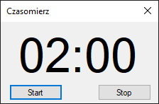

# countdown-timer
This project was made for my friend in need, who couldn't find similar software to fit his strict needs. It's pretty barebones in its current implementation, but for a reason.

### The requirements for this idea were as stated:
- Countdown timer that's always set to 2 minutes
- It should have audio feedback (beeping sound) for the last 5 seconds of counting down
- It should reset on it's own after the time hits 00:00
- Clear and minimal UI
- UI should only consist of 2 buttons and visual representation of time left
- Application window have to be always on top

### Application structure:
- Interruptable:
	This class allows its derived classes to implement timed events in a simple way.
- Sound: 
	This class allows to load and play single sound file.
	It can be loaded through project's resources directory, or directly from sound file path that's relative to app's executable path
- Clock:
	This class implements the whole logic of our countdown timer.
	It derives from Interruptable class to decrement the time in equal intervals, and also uses Sound class to play the beep sound.
	It also returns already formatted time string for the UI part.
	
Main UI form also makes use of DispatcherTimer class to keep itself updated with current data.